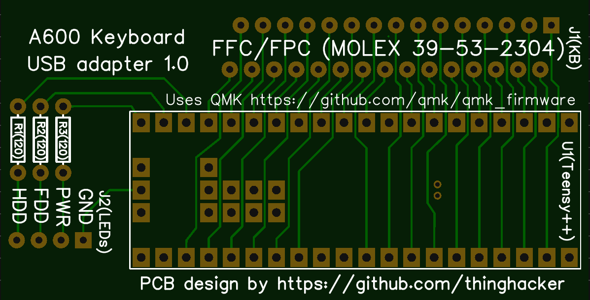

# Amiga 600 USB Keyboard Adapter
This project enables an existing Amiga 600 Keyboard to operate as a USB Keyboard with the Case LEDs to indicate power/scroll lock and numlock.

The [Amiga 600 QMK_Firmware image ](https://github.com/thinghacker/qmk_firmware/tree/amiga600/keyboards/amiga600) has been designed to work with this PCB a precompiled version can be found in this projects **qmk_firmware** directory.

###Bill of Materials

|Designation              | Item    | Description | Supplier and Part|
| ------------ | ------------ |------------ | ---------- |
| U1 | Teensy++ 2.0 | AT90USB1286 USB dev board | https://www.pjrc.com/store/teensypp.html also known as AdaFruit 731| 
|J1|30 Pin FPC Connector 1.25mm spacing|Connects to the Amiga 600 Keyboard Ribbon|Molex 39532304 available from Digikey as WM2866-ND|
|J2|4 Pin Header Right Angle PCB Mount 2.54mm spacing|Connects to Amiga 600 Case LEDs|Sullins Connector Solutions SWR25X-NRTC-S04-RB-BA  available from Jaycar as HM3424|
|R1, R2 & R3|120 Ohm Resistor|Current limiters for LEDs|various|

###PCB
This is a two layer through hole design.  It was made using [Easy EDA](https://easyeda.com/ "Easy EDA") with the associated PCB source in the projects **EasyEDA Source** directory.  I used their affiliate to manufacture the PCBs and was happy with the outcome and the cost, however this is not essential.  Easy EDA supports generating Gerber files that can be used by other vendors, or if you have the materials you can produce the PCB yourself.  Gerber files are in the projects **Gerber** Directory

PCB Top Layer

PCB Bottom Layer

Assembled PCB

###Construction Notes
While this PCB does not require advanced soldering skills, it may be best to work with an experienced friend or watch some youtube videos on build techniques.

The Teensy requires programming before use and can be programmed in circuit. If you haven't worked with one before, https://www.pjrc.com/teensy/first_use.html is probably a good place to start - followed by using the teensy loader to load the keyboard hex code.

Testing should be relatively straight forward - open a text editor and start typing, alternatively there is a humorous though effective web based tester at http://www.keyboardtester.com/

This is project is distributed under a GPL Version 2 License

No claims to the name or any trademarks associated with Amiga are asserted here.
